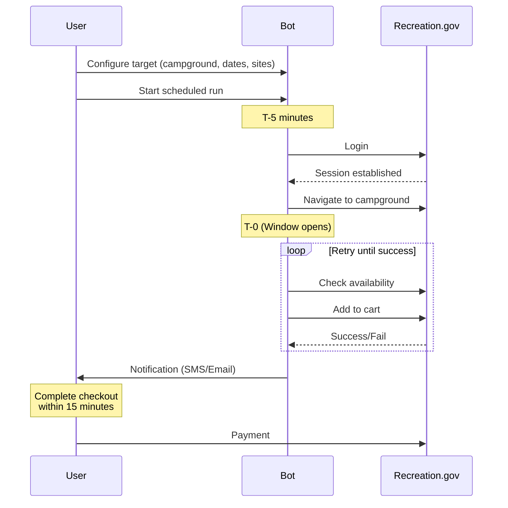
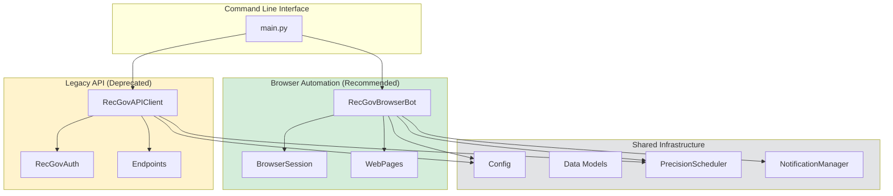
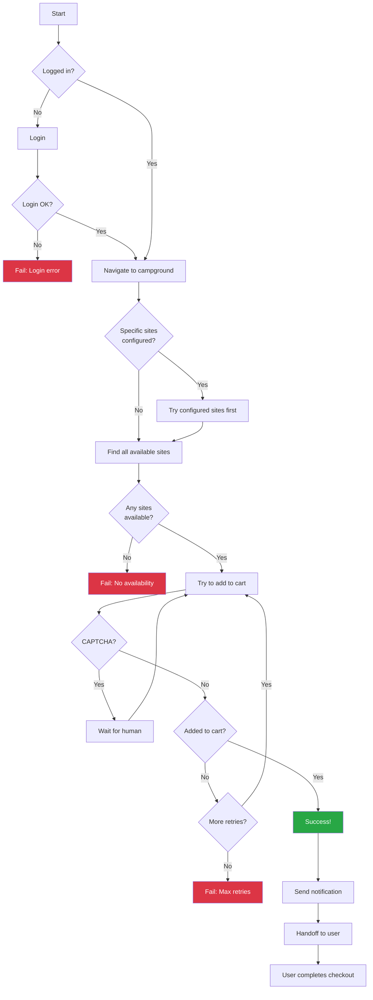

# Recreation.gov Campsite Reservation Bot

An automated tool to secure highly competitive campsite reservations on Recreation.gov the moment they become available.

> **Disclaimer:** This tool is for educational and personal use only. Using automated tools may violate Recreation.gov's Terms of Service and could result in account suspension. Use at your own risk.

## How It Works

Recreation.gov campsite reservations for popular locations (like Yosemite) are released at a specific time (typically 7:00 AM PT, 6 months in advance). This bot automates the reservation process with millisecond precision timing.



## Architecture



### Two Approaches

| Feature | Browser Mode | API Mode (Legacy) |
|---------|-------------|-------------------|
| Speed | ~500ms per attempt | <100ms per attempt |
| Reliability | High | May break without notice |
| CAPTCHA | Pauses for human | Fails |
| Recommended | Yes | No |

## Project Structure

```
recgov-bot/
├── main.py                    # CLI entry point
├── config/
│   ├── config.yaml            # Your configuration (gitignored)
│   └── config.example.yaml    # Template
├── src/
│   ├── browser/               # Playwright-based automation
│   │   ├── bot.py             # Main browser bot (780 lines)
│   │   ├── session.py         # Cookie/session management
│   │   └── urls.py            # URL builders
│   ├── legacy/                # Direct API (deprecated)
│   │   └── api/
│   │       ├── client.py      # HTTP API client
│   │       ├── auth.py        # Authentication
│   │       └── endpoints.py   # Reverse-engineered endpoints
│   └── common/                # Shared utilities
│       ├── config.py          # Pydantic configuration
│       ├── models.py          # Data models
│       ├── scheduler.py       # Precision timing
│       └── notifications.py   # SMS/Email/Webhook alerts
└── tests/                     # Comprehensive test suite (237 tests)
```

## Scheduled Reservation Timeline

```mermaid
gantt
    title Reservation Window Timeline
    dateFormat HH:mm:ss
    axisFormat %H:%M:%S
    
    section Preparation
    Wait for prep time     :done, 06:55:00, 5m
    Login & authenticate   :active, 06:55:00, 30s
    Navigate to campground :06:55:30, 30s
    Session refresh loop   :06:56:00, 4m
    
    section Execution
    Window opens (GO!)     :crit, 07:00:00, 1s
    Attempt reservation    :crit, 07:00:00, 10s
    Retry if needed        :07:00:10, 20s
    
    section Handoff
    Notify user            :07:00:30, 5s
    User completes checkout:07:00:35, 15m
```



## Installation

```bash
# Clone the repository
git clone https://github.com/wmarkus/recgov-bot.git
cd recgov-bot

# Create virtual environment
python -m venv venv
source venv/bin/activate  # Windows: venv\Scripts\activate

# Install dependencies
pip install -r requirements.txt

# Install browser (for browser mode)
playwright install chromium
```

## Configuration

Copy and edit the config file:

```bash
cp config/config.example.yaml config/config.yaml
```

```yaml
# config/config.yaml
credentials:
  email: "your-email@example.com"
  password: "your-password"

target:
  campground_id: "232447"           # Upper Pines, Yosemite
  campsite_ids: ["42", "38", "15"]  # Priority order (optional)
  arrival_date: "2025-08-15"
  departure_date: "2025-08-17"

schedule:
  window_opens: "2025-02-15 07:00:00"  # When reservations open
  timezone: "America/Los_Angeles"
  early_start_ms: -100                  # Start 100ms early

notifications:
  email:
    enabled: true
    address: "your-email@example.com"
    sendgrid_api_key: "SG.xxx"
  sms:
    enabled: false
    # phone: "+1234567890"
    # twilio_account_sid: "ACxxx"
    # twilio_auth_token: "xxx"
    # twilio_from_number: "+1987654321"
```

## Usage

### Browser Mode (Recommended)

```bash
# Test login and availability check
python main.py browser test

# Run at scheduled time (waits for window)
python main.py browser schedule

# Attempt reservation immediately
python main.py browser now
```

### Legacy API Mode

```bash
# Check availability
python main.py legacy-api check

# Attempt reservation
python main.py legacy-api reserve
```

### View Configuration

```bash
python main.py info
```

## Reservation Flow Detail



## Finding Campground and Site IDs

1. Go to [recreation.gov](https://recreation.gov)
2. Search for your campground
3. The URL contains the ID: `recreation.gov/camping/campgrounds/232447`
4. For specific campsites, click on one: `recreation.gov/camping/campsites/12345`

**Popular Campground IDs:**
- Upper Pines (Yosemite): `232447`
- North Pines (Yosemite): `232450`
- Lower Pines (Yosemite): `232449`
- Camp 4 (Yosemite): `10083839`

## Notification Setup

### Email (SendGrid)

1. Create account at [sendgrid.com](https://sendgrid.com)
2. Generate API key with "Mail Send" permission
3. Add to config:
```yaml
notifications:
  email:
    enabled: true
    address: "you@example.com"
    sendgrid_api_key: "SG.your-key"
```

### SMS (Twilio)

1. Create account at [twilio.com](https://twilio.com)
2. Get a phone number
3. Add to config:
```yaml
notifications:
  sms:
    enabled: true
    phone: "+1234567890"
    twilio_account_sid: "ACxxx"
    twilio_auth_token: "xxx"
    twilio_from_number: "+1987654321"
```

## Troubleshooting

| Issue | Solution |
|-------|----------|
| "Site no longer available" | Someone else got it first. Add backup sites. |
| CAPTCHA triggered | Browser mode pauses for you to solve manually. |
| Session expired | The bot auto-refreshes. Increase `prep_time` if needed. |
| Rate limited | Reduce polling frequency in config. |
| Login failed | Check credentials. Recreation.gov may be down. |

## Development

### Running Tests

```bash
# Run all tests
pytest tests/ -v

# Run with coverage
pytest tests/ --cov=src --cov-report=html
```

### Code Structure

- **Pydantic models** for all configuration and data
- **Async/await** throughout for concurrent operations
- **Rich** for beautiful CLI output
- **Playwright** for browser automation

## API Endpoints (Reference)

These are reverse-engineered and may change:

```
GET  /api/camps/availability/campground/{id}/month?start_date={ISO_DATE}
GET  /api/search?q={query}&entity_type=campground
POST /api/ticket/reservation  # Add to cart
GET  /api/ticket/cart         # View cart
```

## License

MIT - Use responsibly.

## Contributing

Contributions welcome! Please:
1. Add tests for new features
2. Run `pytest` before submitting
3. Follow existing code style
